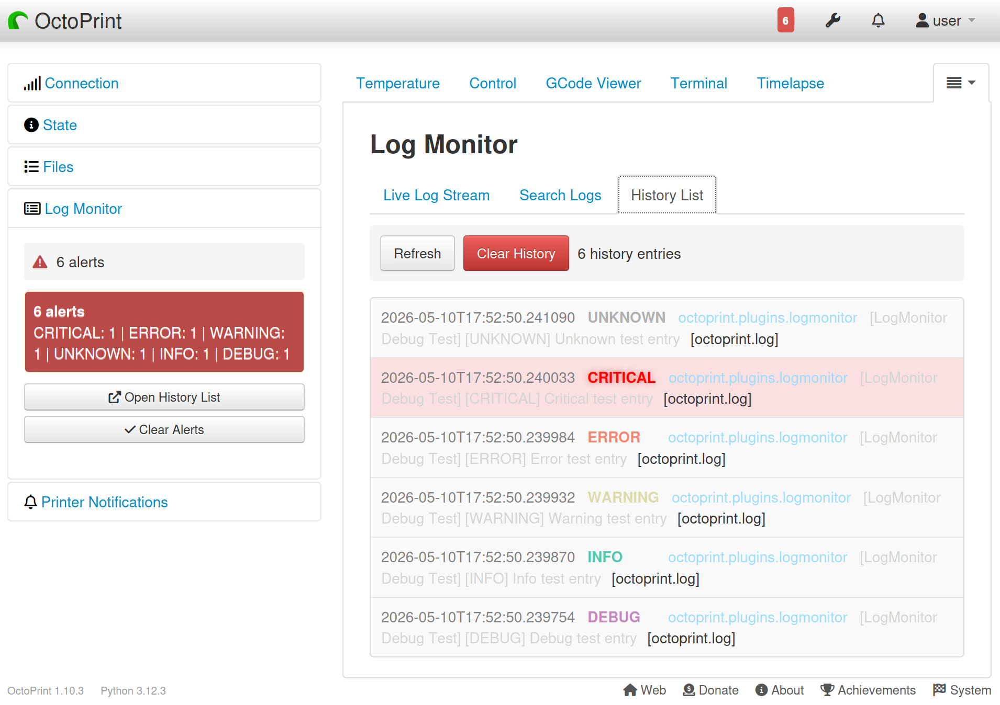

<!-- markdownlint-disable MD041 MD033 -->

  

<h1 align="center">OctoPrint‑LogMonitor</h1>
<!-- markdownlint-enable MD041 MD033 -->

### Live log streaming and searching for OctoPrint with severity alerting in the navbar and sidebar

<!-- markdownlint-disable MD033-->

<!-- markdownlint-enable MD033-->

## Highlights

- 🔴 **Live Log Streaming** - Real-time log monitoring with tail-like behavior
- 🔍 **Full-Text Search** - Search through log files with pagination
- ⚠️ **Severity Alerts** - Visual indicators in Navbar and Sidebar for ERROR/CRITICAL events
- 🎨 **Syntax Highlighting** - Color-coded severity levels (DEBUG, INFO, WARNING, ERROR, CRITICAL)
- 🔧 **Configurable** - Customize trigger levels, polling intervals, and display options
- 📊 **Multiple Log Files** - Support for all OctoPrint log files
- 🎯 **Smart Filtering** - Filter by severity level and free text in real-time
- 📈 **Alert History** - View recent alerts with timestamps and messages
- 📥 **Log Download** - Download log files directly from the plugin tab
- 🧪 **Advanced Search** - Optional regex and case-sensitive search modes
- 📤 **Export Results** - Export filtered/search results for offline analysis
- 🔀 **Multi-Stream API** - Backend endpoints for parallel streaming of multiple logs
- 🛡️ **Secure** - Path traversal protection, input validation, and rate limiting

## Installation

### Via Plugin Manager (Recommended)

1. Open OctoPrint web interface
2. Navigate to **Settings** → **Plugin Manager**
3. Click **Get More...**
4. Click **Install from URL** and enter: `https://github.com/Ajimaru/OctoPrint-LogMonitor/releases/latest/download/OctoPrint-LogMonitor-latest.zip`

5. Click **Install**
6. Restart OctoPrint

### Manual Installation

<!-- markdownlint-disable MD033 -->

Manual pip install

`pip install https://github.com/Ajimaru/OctoPrint-LogMonitor/releases/latest/download/OctoPrint-LogMonitor-latest.zip`

The `releases/latest` URL always points to the newest stable release.

<!-- markdownlint-enable MD033 -->

## Configuration

Access plugin settings via OctoPrint Settings → Plugins → Log Monitor

### Display Settings

- **Show in Navbar** - Display alert badge in navigation bar
- **Show in Sidebar** - Display status widget in sidebar

### Severity Triggers

Configure which severity levels trigger alerts:

- DEBUG
- INFO
- WARNING _(default)_
- ERROR _(default)_
- CRITICAL _(default)_

### Streaming Settings

- **Poll Interval** - How often to check for new log entries (default: 5s)
- **Max Stream Lines** - Maximum number of lines in buffer (default: 500)
- **Auto-scroll** - Automatically scroll to bottom (default: enabled)

### Search Settings

- **Results per Page** - Number of search results per page (default: 50)
- **Regex Search** - Optional regular expression search mode
- **Case-Sensitive Search** - Toggle exact case matching for queries

## Usage

### Live Streaming

1. Navigate to the **Log Monitor** tab
2. Select a log file from the dropdown
3. Click **Start Streaming**
4. Watch logs in real-time with color-coded severity levels

**Controls:**

- Use checkboxes to filter by severity level
- Enter text in filter box for real-time client-side filtering
- Click **Clear** to remove all displayed lines
- Toggle **Auto-scroll** to control scroll behavior

### Searching Logs

1. Scroll down to the **Search Logs** section
2. Enter your search query
3. Select severity levels to include
4. Click **Search**
5. Navigate results with pagination controls

### Alerts

When a log entry matches configured trigger severities (default: WARNING/ERROR/CRITICAL):

- A badge appears in the Navbar (if enabled)
- The Sidebar widget updates (if enabled)
- Click the badge/widget to open the Log Monitor tab and reset alerts

## Contributing

Contributions are welcome! Please see [CONTRIBUTING.md](CONTRIBUTING.md) for detailed guidelines and instructions.

Please also follow our [Code of Conduct](CODE_OF_CONDUCT.md).

## License

AGPLv3 - See [LICENSE](LICENSE) for details.

## Support

- 🐛 **Bug Reports**: [GitHub Issues](https://github.com/Ajimaru/OctoPrint-LogMonitor/issues)
- 💬 **Discussion**: [GitHub Discussions](https://github.com/Ajimaru/OctoPrint-LogMonitor/discussions)

Note: For logs and troubleshooting, enable "debug logging" in the plugin settings.

## Credits

- **Development**: Built following [OctoPrint Plugin Guidelines](https://docs.octoprint.org/en/main/plugins/index.html)
- **Contributors**: See [AUTHORS.md](AUTHORS.md)

## 100% Badge Coverage

Summary: this project exposes many status and quality badges (CI, linting, coverage, releases, maintenance, etc.). The full badge set is available below; click to expand for details.

<!-- markdownlint-disable MD033 -->

Show all badges

### 🏗️ 1. Build & Test Status

### 🧪 2. Code Quality & Formatting

### 🔄 3. CI/CD & Release

### 📊 4. Repository Activity

### 🧾 5. Metadata

<!-- markdownlint-enable MD033 -->

---

  

**Like this plugin?** ⭐ Star the repo and share it with the OctoPrint community!
